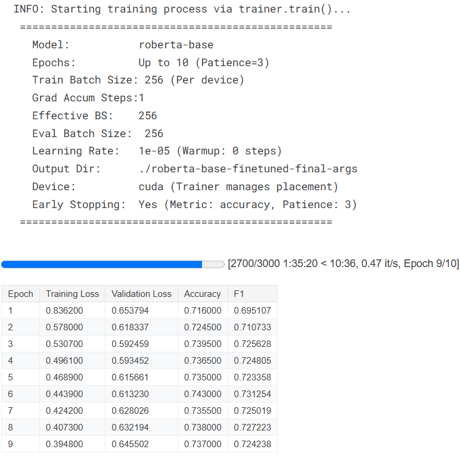

# 📊 Social Sentiment Analysis

A social media sentiment classifier fine-tuned from RoBERTa using PyTorch. Given any sentence or online comment, the model predicts its sentiment class: **positive**, **neutral**, or **negative**. Built with real-world social data and deployed with a clean, interactive Streamlit UI.

🔗 **Live Demo**: [Try on Hugging Face Spaces](https://alaindelong-social-sentiment-analysis.hf.space/)  
📦 **Dataset**: [TweetEval](https://huggingface.co/datasets/cardiffnlp/tweet_eval) by Cardiff NLP

---

## 🚀 Features

- Fine-tuned **RoBERTa** model on the **TweetEval** dataset for sentiment classification
- Web interface built with **Streamlit** for live prediction and social media analysis
- **YouTube Comments Analysis** via Google’s **YouTube Data API v3**
- Interactive **sentiment visualization** with **Plotly**
- Deployed on Hugging Face Spaces — no local setup required

---

## 🧠 Project Overview

### 🔧 Model Training
- Used `cardiffnlp/tweet_eval` dataset via Hugging Face Datasets
- Fine-tuned a pretrained RoBERTa model using PyTorch for 3-class sentiment classification
- Saved model checkpoint for inference in Streamlit app

### 🖥️ App Interface

The app includes **three key functionalities**:

1. **Single Sentence Prediction**  
   Input any sentence or comment and receive the predicted sentiment with class probabilities.

2. **YouTube Comments Analysis**  
   Enter a YouTube video URL → fetch all comments using **YouTube Data API v3**  
   → run sentiment prediction on each comment → display results in an interactive **Plotly chart**.

3. **Twitter (X) Comments Analysis** *(Coming Soon)*  
   Planned feature: fetch replies to a Tweet URL and analyze the overall sentiment breakdown.

---

## 📈 Fine-tuning Results

Below are the training and evaluation results of the RoBERTa sentiment classifier:

---

## 📊 Visualization Example

](images/youtube.png)

---

## 🛠️ Tech Stack

- PyTorch, Hugging Face Transformers, Datasets
- Streamlit, Plotly
- YouTube Data API v3 (Google Cloud)
- Hugging Face Spaces for deployment